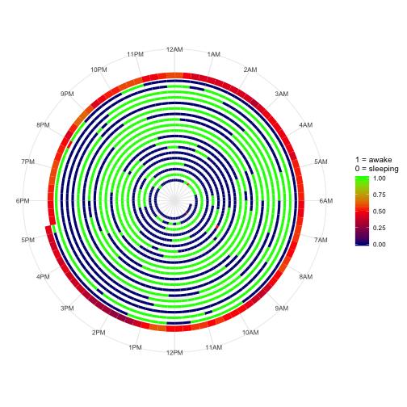

Developing Data Products Course Project - The "Naptime" Graphic App
========================================================
author: Eric Allen
date: 9/19/2019
autosize: true

Creating your own version of *<a href="https://www.washingtonpost.com/news/wonk/wp/2017/01/05/what-its-like-to-sleep-like-a-baby-visualized-by-a-dad/" target="_blank">"the most beautiful data visualization of all time"</a>*

From Data to Keepsake 
========================================================

<small>Any new parent will always remember the first few months of their baby's lives.  In 2017 Australian Redditor, going by the handle “andrew_elliott”, created the data visualization below to capture the first six months of his baby's life.</small> 

<small>The purpose of <a href="https://erallen.shinyapps.io/naptime/" target="_blank">this app</a> is to allow anyone to create a similiar visulization of their baby's experience.</small> 

Interpreting the Naptime Graphic
========================================================

<small>The example graphic above is based on randomly generated data (*it's an R expression that gets evaluated and displayed when rendering this presentation*).
***
- The spirals show a baby's sleep status within 15 minute segments for a 24 hour period. 0/Blue indicates asleep and 1/Green indicates awake. Other values (most often red) indicate more than one sleep/wake cycle within the 15 minute period. (This could be interpreted as the baby's fussy period.) 
- The outer ring of the graphic, which is wider, indicates the predicted probability of being asleep or awake during a particular segment within the next 24 hours based on data from the prior days.</small>

How it functions
========================================================

- The user can select the date range you wish to focus on within the data. 
- The user can up upload thier own data in a comma delimited (*.csv) file (the app loads with example data)
    + data must contain a header row of ["napt","event"]
    + additional rows of sleep data containing a timestamp and event code (0 for 'went to sleep' and 1 for 'woke up')
    + Event rows must be in the following format [YYYY-MM-DD HH:MM:SS,#] for example [2019-01-15 03:37:40,0]. 
    
    (note: the square brackets [ ] in examples are not included in the actual data.) 

Links, References and Credits
========================================================

Links
- <a href="https://erallen.shinyapps.io/naptime/" target="_blank">The "Naptime" Graphic App</a> (please give it 10-30 seconds to load initially)
- <a href="https://github.com/erallenUM91/naptime" target="_blank">Github Repository with app code and .Rpres file</a>

References and Credits
- <a href="https://www.reddit.com/r/dataisbeautiful/comments/77tcnv/300_days_of_a_babys_sleeping_data_oc/" target="_blank">Reddit post by Andrew Elliot</a>
- <a href="https://www.washingtonpost.com/news/wonk/wp/2017/01/05/what-its-like-to-sleep-like-a-baby-visualized-by-a-dad/" target="_blank">"Washington Post article on the graphic and Reddit user vote by Christopher Ingraham"</a>
- <a href="https://perso.telecom-paristech.fr/eagan/class/igr204/data/BabyData.zip" target="_blank">example baby sleep data</a> from <a href="https://perso.telecom-paristech.fr/eagan/class/igr204/datasets" target="_blank">datasets gathered and cleaned up by Petra Isenberg, Pierre Dragicevic and Yvonne Jansen</a>
- Very helpful <a href="https://stackoverflow.com/questions/39480841/how-to-create-a-time-spiral-graph-using-r" target="_blank">post and response on StackOverflow on spiral graphics</a>
